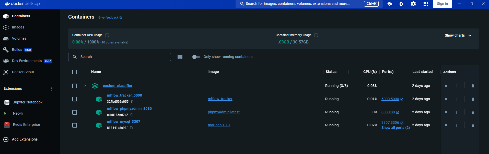
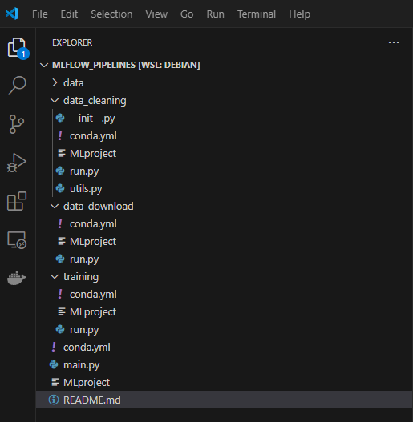

# MLFLOW Projects
### Documentation

https://mlflow.org/docs/latest/projects.html

# mlflow.run()
https://mlflow.org/docs/latest/python_api/mlflow.projects.html#mlflow.projects.run

you can download the titanic file from https://raw.githubusercontent.com/datasciencedojo/datasets/master/titanic.csv

# MLFLOW
if you have already a tracking server set before run the variable  MLFLOW_TRACKING_URI 
```bash
export MLFLOW_TRACKING_URI=http://127.0.0.1:5000
```
In my case I have MLflow infrastructure running in docker




# Project Organization



# Run the pipeline

```python
mlflow run . -P steps="data_download,data_cleaning,training" -P data_url="https://raw.githubusercontent.com/datasciencedojo/datasets/master/titanic.csv" --experiment-name pipelines
```

# Using Databricks as Tracking server

- crear a workspace in AWS/Azure/GCP
- install Databricks CLI --> https://docs.databricks.com/en/dev-tools/cli/install.html and configure
- create an access token in settings -> Developer --> Access token
- set env variables

# Install databricks CLI

sudo curl -fsSL https://raw.githubusercontent.com/databricks/setup-cli/main/install.sh | sudo sh
export PATH="/usr/local/bin:$PATH"

then execute databricks -v

use host and token when runing databricks configure

# Set environtment variables

- export MLFLOW_TRACKING_URI=databricks
- export DATABRICKS_HOST="https://adb-XXXXXXXXXXXXXXXXXX.5.azuredatabricks.net"
- export DATABRICKS_TOKEN="dapi---------------------------"

# run Pipeline in Databricks

Note replace o---k@---.com with the user in Databricks
```python
mlflow run . -P steps="data_download,data_cleaning,training" -P data_url="https://raw.githubusercontent.com/datasciencedojo/datasets/master/titanic.csv" --experiment-name /Users/o---k@---.com/pipelines --run-name workflow
```

